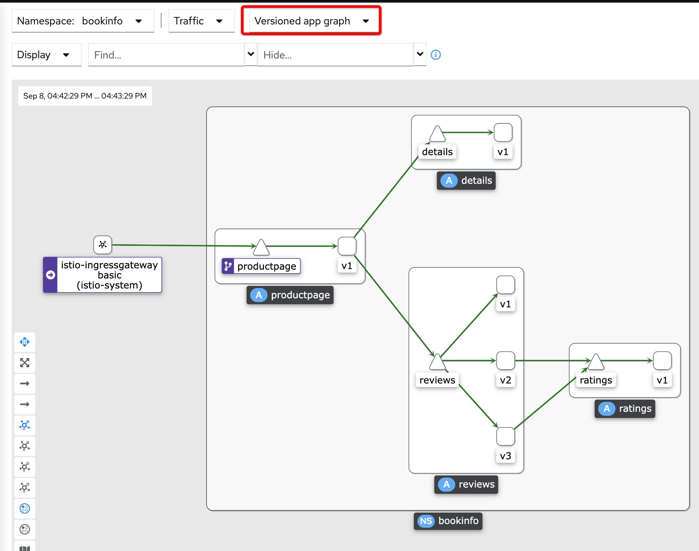
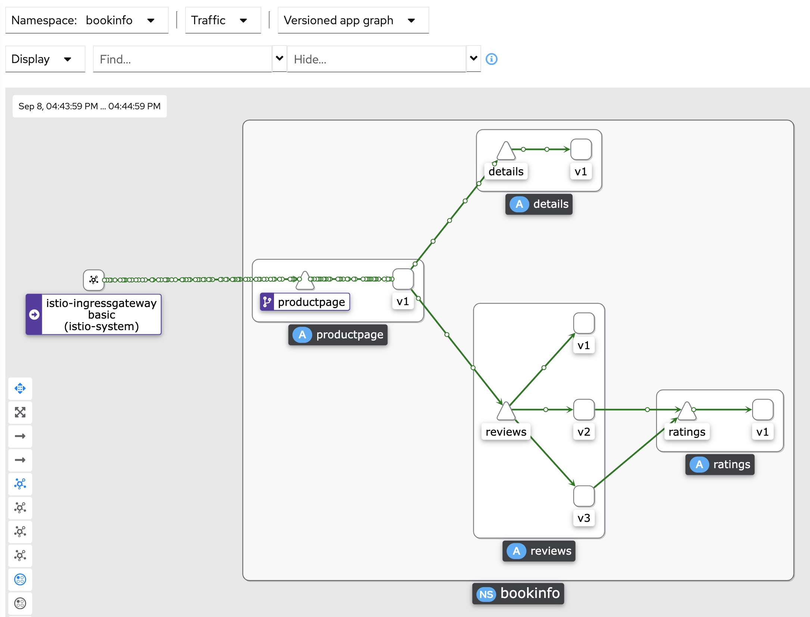
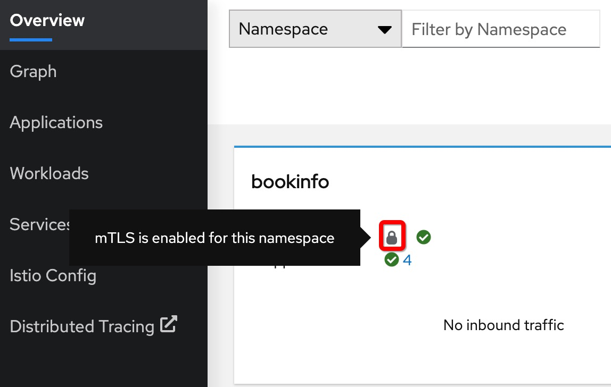
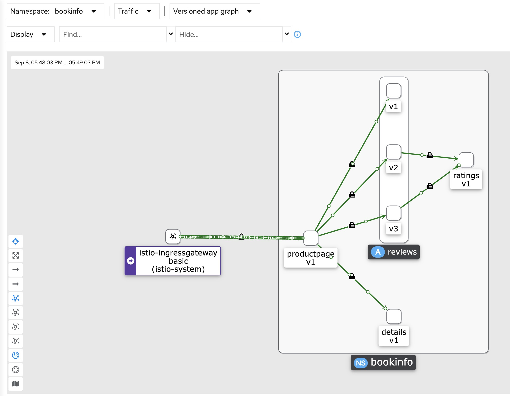

# Demo Application of OpenShift Service Mesh

## Bookinfo示例程序介绍

Bookinfo 应用程序显示一本书的信息，类似于在线书店的单一目录条目。应用会显示一个页面，其中描述了图书详细信息（ISBN、页数和其他信息）以及图书的评论。

Bookinfo 应用程序由这些微服务组成：
- productpage 微服务调用 details 和 reviews 微服务来产生页面信息。
- details 微服务包括了书的信息。
- reviews 微服务包括了书的评论。它同时还会调用 ratings 微服务。
- ratings微服务包括了带有对本书的评论信息的评分信息。

reviews 微服务有三个版本：
- 版本 v1 不调用 ratings 服务。
- 版本 v2 调用 ratings 服务，并以一到五个黑色星来代表对本书的评分。
- 版本 v3 调用 ratings 服务，并以一到五个红色星来代表对本书的评分。

Bookinfo应用程序的应用拓扑图如下：


## 部署Bookinfo示例程序

### 前提条件

实验环境：
- OpenShift 4.10.28
- OpenShift Service Mesh 2.2.2

角色权限：
- 本例采用Cluster Admin操作

前提条件：
1. 已经在OpenShift上安装了OpenShift Service Mesh
2. 已经创建了`istio-system`命名空间
3. 已经在`istio-system`命名空间上创建了ServiceMeshControlPlane

### 目录结构

目录结构说明：
```bash
├── app # Kuberentes YAML
├── istio # Istio配置，采用kustomization的base/overlays目录结构
│   ├── base # Istio公共配置
│   └── overlays
│       ├── mtls # 启用了mtls的配置
│       └── nomtls # 没有启用mtls的配置
└── servicemesh # OpenShift Service Mesh配置
```

### 创建应用程序所在的项目

```bash
oc new-project bookinfo
```

### 创建 ServiceMeshMemberRoll

```bash
# 检查ServiceMeshMemberRoll(smmr)
oc get smmr -n istio-system -o wide

# 如果ServiceMeshMemberRoll为空，则创建一个新的ServiceMeshMemberRoll，并纳管bookinfo命名空间
oc create -n istio-system -f servicemesh/servicemeshmemberroll-default.yaml

# 验证ServiceMeshMemberRoll(smmr)
oc get smmr -n istio-system -o wide
```

### 部署Bookinfo应用程序

```bash
oc apply -n bookinfo -f app
```

Bookinfo应用程序的Deployment YAML已经配置启用sidecar自动注入：
```yaml
spec:
  template:
    metadata:
      annotations:
        sidecar.istio.io/inject: "true"
```

将创建以下Kuberentes资源：
```bash
deployment.apps/details-v1 created
deployment.apps/productpage-v1 created
deployment.apps/ratings-v1 created
deployment.apps/reviews-v1 created
deployment.apps/reviews-v2 created
deployment.apps/reviews-v3 created
serviceaccount/bookinfo-reviews created
service/details created
service/productpage created
service/ratings created
service/reviews created
serviceaccount/bookinfo-details created
serviceaccount/bookinfo-ratings created
serviceaccount/bookinfo-productpage created
```

### 配置Istio

```bash
oc apply -n bookinfo -k istio/overlays/nomtls
```

将创建以下Istio资源：
```bash
gateway.networking.istio.io/bookinfo-gateway created
virtualservice.networking.istio.io/bookinfo created
destinationrule.networking.istio.io/details created
destinationrule.networking.istio.io/productpage created
destinationrule.networking.istio.io/ratings created
destinationrule.networking.istio.io/reviews created
```

说明：
- 这里使用没有启用mTLS的DetinationRule


### 查看Istio Ingress Gateway

```bash
oc -n istio-system get route istio-ingressgateway
```

设置`GATEWAY_URL`环境变量为Istio Ingress Gateway地址：
```bash
export GATEWAY_URL=$(oc -n istio-system get route istio-ingressgateway -o jsonpath='{.spec.host}')
```

### 验证Bookinfo程序

验证Pod状态：
```bash
oc get pods -n bookinfo
```

验证每个Pod都被自动注入了一个sidecar proxy容器：
```bash
kubectl get pods -n bookinfo -o jsonpath="{.items[*].spec.containers[*].name}"
```

在浏览器中访问Bookinfo程序的产品页面：
```bash
echo "http://$GATEWAY_URL/productpage"
```

在浏览器中不断刷新产品页面，会看到书的评分会出现以下3种情况：
- 没有评分 （productpage-v1 -> reviews-v1)
- 五星黑色评分 （productpage-v1 -> reviews-v2 -> ratings-v1)
- 五星红色评分 （productpage-v1 -> reviews-v3 -> ratings-v1)

注意：
- 此时流量是通过Istio Ingress Gateway进来
- 不需要有对应的productpage route


### 访问Kiali控制台

访问Kiali地址：
```bash
oc -n istio-system get route kiali
```

在Kiali中查看：
- Overview
    - 可以看到`bookinfo`命名空间
- Graph
    - 查看应用拓扑和网络结构，需要有网络流量时才能正常显示图
- Applications
- Workloads
- Services
- Istio Config
- Distributed Tracing
    - 打开Jaeger


在Overview的`istio-system`命名空间，还可以查看以下Grafana dashboard：
- Istio Mesh Dashboard
- Istio Control Plane Dashboard
- Istio Performance Dashboard
- Istio Wasm Extension Dashboard

### 模拟多个用户同时访问Bookinfo程序

用[siege](https://github.com/JoeDog/siege)模拟30秒内并发10个用户来访问Bookinfo程序：
```bash
siege -t30s -c10 http://$GATEWAY_URL/productpage
```

同时在Kiali中打开bookinfo的Graph观察应用拓扑，选择显示为“Versioned App Graph”来查看不同版本的服务关系：


在Display中勾选Show / Traffic Animation后，可以看到网络流量流动的动画效果：


### 启用mTLS

请先确保启用了mTLS：
- https://access.redhat.com/documentation/zh-cn/openshift_container_platform/4.10/html-single/service_mesh/index#ossm-security-enabling-strict-mtls_ossm-security

在Bookinfo程序中启用有mTLS的DetinationRule:
```bash
oc apply -n bookinfo -k istio/overlays/mtls
```

在Kiali的Overview中查看`bookinfo`命名空间上有【锁头】图标。


在Graph中，选择Show Badges / Security，可以看到路由中显示有【锁头】图标。


## References

- [Bookinfo示例程序](https://access.redhat.com/documentation/zh-cn/openshift_container_platform/4.10/html/service_mesh/ossm-tutorial-bookinfo-overview_ossm-create-mesh)
- [Bookinfo程序部署YAML](https://raw.githubusercontent.com/Maistra/istio/maistra-2.2/samples/bookinfo/platform/kube/bookinfo.yaml)
- [Bookinfo程序Istio Gateway配置](https://raw.githubusercontent.com/Maistra/istio/maistra-2.2/samples/bookinfo/networking/bookinfo-gateway.yaml)
- [Bookinfo程序Istio DestinationRule配置](https://raw.githubusercontent.com/Maistra/istio/maistra-2.2/samples/bookinfo/networking/destination-rule-all.yaml)
- [Bookinfo程序Istio DestinationRule MutualTLS配置](https://raw.githubusercontent.com/Maistra/istio/maistra-2.2/samples/bookinfo/networking/destination-rule-all-mtls.yaml)
- [OpenShift Service Mesh 2.2 samples](https://github.com/maistra/istio/tree/maistra-2.2/samples)